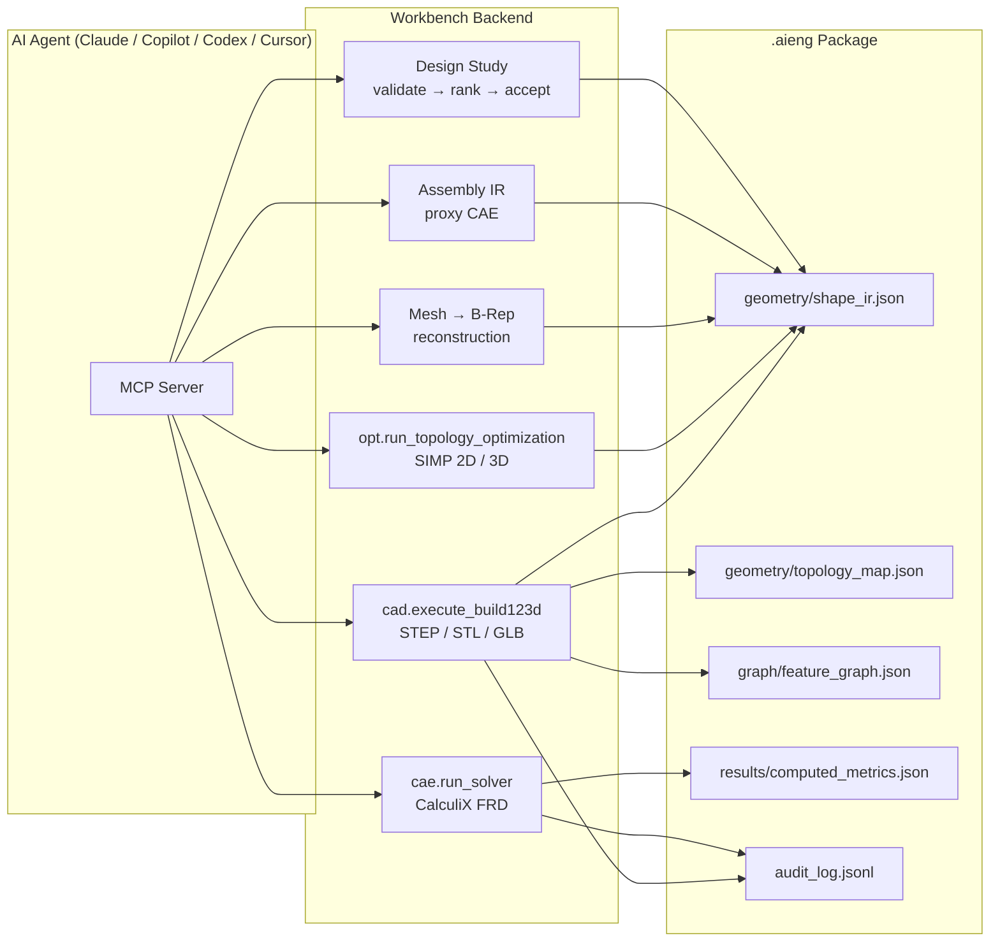

# aieng — CAD/CAE Agent Workbench


A co-pilot platform for mechanical engineering. It lets AI agents (Claude Code,
GitHub Copilot, OpenAI Codex, Cursor, …) drive **real 3D CAD modeling** (via
[build123d](https://github.com/gumyr/build123d) / OpenCASCADE) and **structural FEA**
(via CalculiX), with every project stored as a self-describing `.aieng` package.

## What this is

An **AI-CAD/CAE backend prototype** that combines:
- **Shape IR** — a neutral geometry intermediate that compiles to build123d/OCP STEP/B-Rep, NURBS, implicit SDF, or Manifold mesh
- **Real CAD generation** — agent-written build123d code runs deterministically; returns STEP/STL/GLB + 4-view thumbnail
- **CAE result mapping** — CalculiX FRD results mapped back to topology entities with `@face:` pointers
- **Topology optimization** — 2D SIMP (stable) + experimental 3D structured-voxel SIMP
- **Mesh-to-CAD reconstruction** — mesh → analytic surface fitting → OCC face generation → stitching → sewing → STEP export (only when shell validates)
- **Assembly-aware optimization** — multi-part assembly IR with proxy CAE, interface resolution, and selected-part topopt
- **Agent-guided design studies** — explicit candidate validation, execution, ranking, and acceptance with baseline preservation

**Honesty boundaries:**
- Not production-certified CAD/CAE — outputs are review material requiring human judgment
- Assembly contact/bolt preload are proxy-only; real nonlinear contact is future work
- 3D SIMP is experimental/reference, not production-certified
- Mesh-to-CAD works best for plane/cylinder-dominant geometry; freeform/NURBS fitting is future work
- Design study is agent-guided explicit execution, not autonomous global optimization

## Highlights

- **Real geometry, no API key** — the agent writes build123d code; the backend runs it deterministically and returns STEP/STL/GLB plus a 4-view thumbnail.
- **Incremental modeling** — `append` builds onto the previous result; parts carry semantic `.label` names and colors that persist across steps.
- **Click-to-pick faces** — the 3D viewer maps each GLB primitive to its exact B-Rep face, so you click a face to bind a CAE load or support (`@face:` pointers).
- **CAD → FEA in one package** — material, BCs, mesh, CalculiX run, and results all live in one self-describing `.aieng` file.
- **Discoverable projects** — builds auto-name from their parts; locate any model by a part label via `aieng.find_projects_by_part`.
- **One source, many representations** — a neutral **Shape IR** compiles through a pluggable backend registry: build123d/OCP (exact STEP/B-Rep), **NURBS** B-Rep surfaces (OCP), implicit **SDF** (organic → mesh), or **Manifold** (CSG mesh). B-Rep targets keep analytic per-face topology; mesh targets give fast previews. STEP/GLB are derived evidence at different levels, recorded in provenance.
- **Conservative mesh-to-CAD ladder:** mesh/topology-optimization outputs can be analyzed into analytic face candidates and OCC-sewn shells. `geometry/reconstructed.step` is written only when OCC validates a closed solid and roundtrip checks run; it is a derived artifact and does not overwrite source/generated STEP. Original mesh topology is preserved at `geometry/mesh_topology_map.json`, and partial shells/invalid solids remove stale reconstructed artifacts instead of making production CAD claims.
- **Assembly CAE + topopt v0:** optional Assembly IR packages can produce a solver-neutral simplified proxy CAE model, optional simplified CalculiX deck when real mesh refs exist, honest skipped solver diagnostics, and assembly result maps back to parts/interfaces/connections. Backend-only assembly-aware topology optimization derives a single selected design-part problem, then explicit execution can run the existing SIMP optimizer and write selected-part derived artifacts (`analysis/assembly_topology_optimization.json`, `diagnostics/assembly_topopt_execution.json`, `parts/<part_id>/...`) while preserving interface regions where mapped. It does not model nonlinear contact, bolt preload, or simultaneous multi-part optimization and is not production certified.
- **Driven over MCP** — one tool registry, usable from Claude Code, Copilot, Codex, and Cursor.

---

## Showcase demos

Four canonical backend demos, each deterministic and self-contained (no external solver required).

### 1. Single-part topology optimization

**Value:** Derives a topology optimization problem from CAE setup, runs SIMP compliance minimization, and writes back optimized geometry as editable Shape IR.

**Demonstrates:** 2D SIMP with density field + compliance history, experimental 3D structured-voxel SIMP, and Shape IR writeback as `extruded_region` / `density_voxels` / `smooth_mesh_proxy`.

```bash
pytest aieng/tests/test_topology_optimization.py -q
```

**Key artifacts:** `analysis/topology_optimization.json`, `geometry/shape_ir.json`

**Boundary:** 2D plane-stress (out-of-plane loads dropped); 3D is experimental/reference; `smooth_mesh_proxy` is preview-only.

[Full details → `aieng/docs/showcase_gallery.md`](aieng/docs/showcase_gallery.md)

### 2. Mesh-to-CAD B-Rep/STEP reconstruction

**Value:** Takes a mesh, segments it, fits analytic surfaces, generates OCC faces, stitches edges, sews into a closed shell, and exports a valid STEP file — with honest fallback when the shell is not closed.

**Demonstrates:** Region segmentation → plane/cylinder fitting → OCC face generation → edge matching → sewing → STEP export (only when shell validates) → roundtrip verification.

```bash
pytest aieng/tests/test_mesh_brep_solidification.py -q
```

**Key artifacts:** `geometry/reconstructed.step` (when valid), `graph/mesh_brep_stitching_plan.json`, `diagnostics/mesh_brep_sewing.json`

**Boundary:** Mesh-derived/lossy; plane/cylinder dominant; freeform/NURBS is future work; partial shells do NOT produce STEP.

[Full details → `aieng/docs/showcase_gallery.md`](aieng/docs/showcase_gallery.md)

### 3. Assembly-aware topology optimization

**Value:** Multi-part assembly with proxy CAE, interface resolution, and selected-part topology optimization while preserving mounting/load interfaces.

**Demonstrates:** Assembly IR → interface resolution → proxy CAE model → topopt problem derivation → SIMP on one selected design part → post-verification + design recommendations.

```bash
pytest aieng-ui/backend/tests/test_assembly_topopt_demo.py -q
```

**Key artifacts:** `analysis/assembly_topology_optimization.json`, `parts/bracket/geometry/optimized_shape_ir.json`, `analysis/assembly_design_recommendations.json`

**Boundary:** Proxy connections only; no real contact/friction; no bolt preload; one design part only; not production-certified.

[Full details → `aieng/docs/showcase_gallery.md`](aieng/docs/showcase_gallery.md)

### 4. Agent-guided parameter design study

**Value:** Agent proposes parameter changes; backend validates, executes into isolated workspaces, ranks by objective/constraints, and allows explicit acceptance of the best safe candidate — baseline never modified.

**Demonstrates:** Problem contract → candidate validation (bounds, protected vars) → explicit execution → static metric evaluation → deterministic ranking → explicit acceptance with `safe_to_accept` gating.

```bash
pytest aieng-ui/backend/tests/test_design_study_demo.py -q
```

**Key artifacts:** `analysis/design_study_candidate_ranking.json`, `analysis/design_study_acceptance.json`, `accepted/candidate_good/geometry/shape_ir.json`

**Boundary:** Static metrics in demo; no autonomous optimization; no baseline overwrite; ranking is advisory.

[Full details → `aieng/docs/showcase_gallery.md`](aieng/docs/showcase_gallery.md)

---

## Architecture



## Demo workflows

```mermaid
flowchart TD
    subgraph TOPOPT["Single-part topology optimization"]
        T1["CAE setup<br/>supports + loads"] --> T2["Derive topopt problem"]
        T2 --> T3["Run SIMP"]
        T3 --> T4["Writeback Shape IR"]
        T4 --> T5["Compile to STEP/GLB"]
    end

    subgraph MESH["Mesh-to-CAD reconstruction"]
        M1["Input mesh"] --> M2["Region segmentation"]
        M2 --> M3["Surface fitting"]
        M3 --> M4["OCC face generation"]
        M4 --> M5["Stitching + sewing"]
        M5 --> M6{"Closed shell?"}
        M6 -->|yes| M7["STEP export + roundtrip"]
        M6 -->|no| M8["Record honest rejection"]
    end

    subgraph ASSY["Assembly-aware topopt"]
        A1["Assembly IR<br/>parts + interfaces"] --> A2["Interface resolution"]
        A2 --> A3["Proxy CAE model"]
        A3 --> A4["Derive topopt problem"]
        A4 --> A5["Run SIMP on selected part"]
        A5 --> A6["Writeback + verification"]
        A6 --> A7["Design recommendations"]
    end

    subgraph STUDY["Agent-guided design study"]
        S1["Problem contract<br/>variables + constraints"] --> S2["Candidate validation"]
        S2 --> S3["Execute into derived workspace"]
        S3 --> S4["Inject evaluation metrics"]
        S4 --> S5["Rank candidates"]
        S5 --> S6{"Best candidate safe?"}
        S6 -->|yes| S7["Explicit acceptance"]
        S6 -->|no| S8["needs_user_input"]
    end
```



---

## Repository layout

| Path | Status | What it is |
|------|--------|------------|
| **`aieng-ui/`** | **Active** | FastAPI backend + React workbench + MCP server — the product |
| `aieng/` | Library | `.aieng` semantic package format engine (schemas, validation, CLI) |
| `aieng-agent-skills/` | Active | SKILL.md contracts teaching agents how to use the ecosystem |
| `aieng-freecad-mcp/` | **Legacy** | Old FreeCAD execution adapter — not used by the active path |
| `CAD-Agent-main/` | Reference | Experimental/auxiliary CAD-agent material |
| `docs/` | — | Workspace-level roadmap & planning |

> The active CAD engine is `aieng-ui/backend` using **build123d** — *not* `aieng/`
> (which ships a stub backend) and *not* the legacy FreeCAD adapter.

---

## Quick start

Prerequisites: a conda env named **`aieng311`** (Python ≥ 3.11) with **build123d**
installed — the MCP config and run scripts assume this name.

```bash
# 1. Create the environment and install the backend (which pulls in build123d)
conda create -n aieng311 python=3.11 -y
conda activate aieng311
pip install build123d
cd aieng-ui/backend && pip install -e .

# 2. Run the backend (FastAPI on http://127.0.0.1:8000)
#    Windows helper handles interpreter selection + port guard:
#      ../scripts/backend.ps1
uvicorn app.main:app --host 127.0.0.1 --port 8000 --reload

# 3. Run the frontend (Vite dev server on http://localhost:5173)
cd ../frontend && npm install && npm run dev
#    Windows helper: aieng-ui/scripts/frontend.ps1
```

Open http://localhost:5173 for the workbench UI.

Run the backend test suite:
```bash
cd aieng-ui/backend && python -m pytest
```

---

## Using it from an AI agent (MCP)

The backend exposes its tool registry as an **MCP server** (`aieng-workbench`), so an
agent drives the workbench through its own harness — no API key needed on our side.

Connection configs are **already committed** and load automatically for a fresh clone
(assuming the `aieng311` env exists):

| Agent | Config file |
|-------|-------------|
| Claude Code | `.mcp.json` |
| VS Code / GitHub Copilot / Cursor | `.vscode/mcp.json` |
| OpenAI Codex | add `[mcp_servers.*]` to `~/.codex/config.toml` (see MCP_SETUP) |

**First three calls every session:**
```
1. aieng.agent_readme                  → full agent guide (AGENTS.md, in-band)
2. aieng.list_projects                 → discover project IDs
3. aieng.agent_context { project_id }  → geometry state, pointers, next steps
```

**The sustainable modeling loop:**
```
cad.get_source            → see accumulated source, named parts, has_base
cad.execute_build123d     → build/extend geometry (mode=replace|append)
                            • set .label on parts → semantic names you can reference
                            • mode=append builds onto `previous_result`
                            • returns a thumbnail + named_parts / parts_added
(inspect the result, repeat)
```

Full details, tool taxonomy, pointer syntax, and approval-gated tools:
**[AGENTS.md](AGENTS.md)** · MCP wiring: **[aieng-ui/backend/MCP_SETUP.md](aieng-ui/backend/MCP_SETUP.md)**

---

## Documentation

| Doc | Purpose |
|-----|---------|
| [AGENTS.md](AGENTS.md) | Canonical agent guide — tools, workflows, conventions (also served by `aieng.agent_readme`) |
| [aieng/docs/showcase_gallery.md](aieng/docs/showcase_gallery.md) | **Showcase gallery** — demo talking points, visual guidance, and honesty boundaries |
| [aieng/docs/demo_catalog.md](aieng/docs/demo_catalog.md) | Backend demo catalog — run commands, expected artifacts, maturity levels |
| [aieng/docs/backend_capability_matrix.md](aieng/docs/backend_capability_matrix.md) | Capability status snapshot (stable / experimental / diagnostic-only / proxy-only) |
| [aieng/docs/backend_artifact_reference.md](aieng/docs/backend_artifact_reference.md) | Complete artifact path reference for geometry, CAE, topopt, reconstruction, assembly |
| [aieng/docs/roadmap.md](aieng/docs/roadmap.md) | Phase-by-phase development roadmap |
| [CLAUDE.md](CLAUDE.md) | Claude Code entry pointer |
| [.github/copilot-instructions.md](.github/copilot-instructions.md) | GitHub Copilot entry pointer |
| [aieng-ui/backend/MCP_SETUP.md](aieng-ui/backend/MCP_SETUP.md) | Per-agent MCP wiring (Claude Code / Copilot / Codex) |

---

## Smoke tests

Run the canonical backend demos in ~15 seconds:

```bash
# Agent-guided design study (PR1–PR4)
pytest aieng-ui/backend/tests/test_design_study_demo.py -q

# Assembly-aware topology optimization
pytest aieng-ui/backend/tests/test_assembly_topopt_demo.py -q

# Mesh-to-CAD B-Rep reconstruction
pytest aieng/tests/test_mesh_brep_solidification.py -q

# Single-part topology optimization
pytest aieng/tests/test_topology_optimization.py -q
```

---

## Notes

- **Private repo.** No secrets are committed; runtime data (`data/projects/`),
  virtual environments, `node_modules`, and embedded conda envs are gitignored.
- If your CAD env is not named `aieng311`, edit the `-n aieng311` argument in the MCP
  configs (or point `command` directly at your interpreter) — see MCP_SETUP.md.
- A running backend at `http://127.0.0.1:8000` enables live UI updates when an agent
  drives a build; if it's down, the MCP server falls back to in-process execution.
