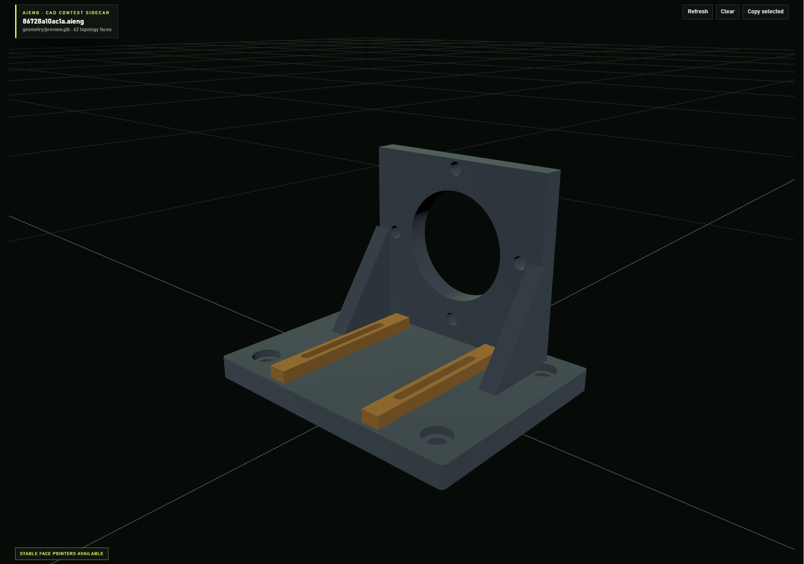
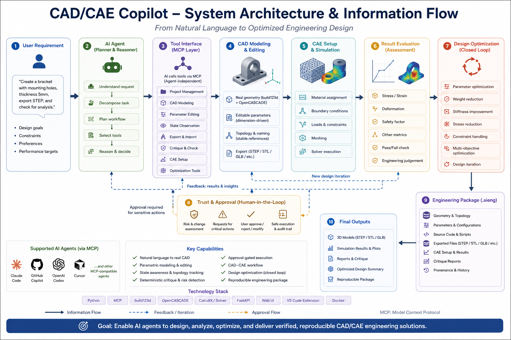
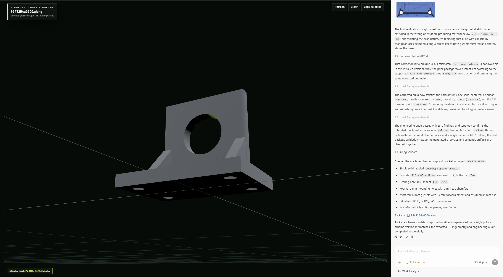
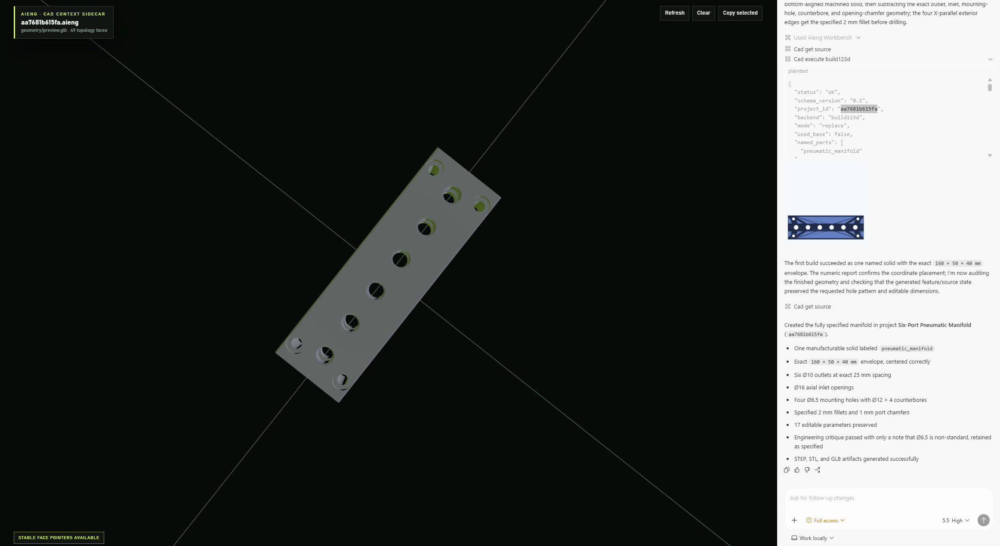
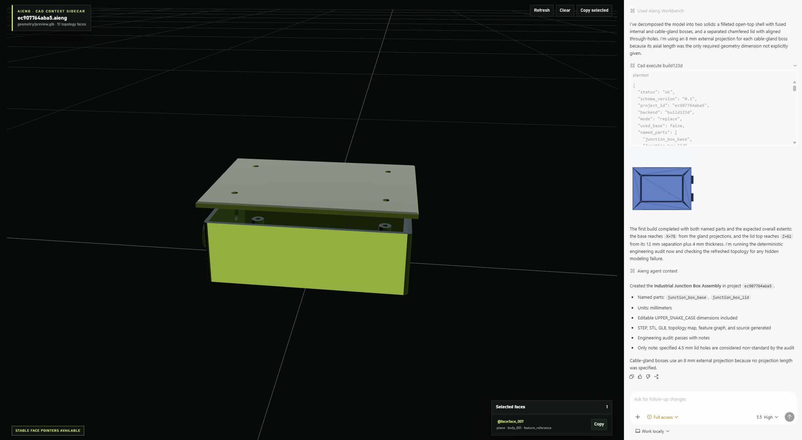
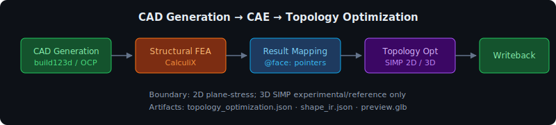
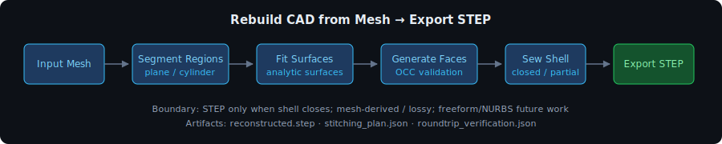
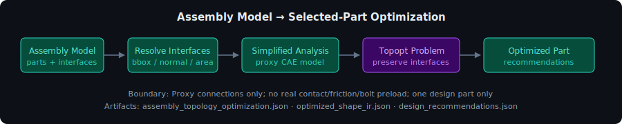
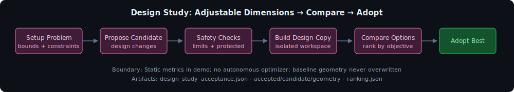

<!-- SEO Keywords: AI CAD, AI CAE, AI CAX, Text-to-CAD, Text-to-CAE, Text-to-CAX, Generative CAD, AI Engineering Workbench, MCP CAD, build123d, OpenCASCADE, CalculiX -->

<div align="center">

# CAD/CAE Copilot

### Most AI CAD tools stop when a picture appears. CAD/CAE Copilot turns an engineering spec into real, editable, verifiable CAD — and keeps every artifact reproducible.

An AI-native CAD/CAE/CAX workbench. An MCP-capable agent writes real
build123d / OpenCASCADE geometry, exports STEP/STL/GLB, names the parts,
exposes stable topology pointers, runs a deterministic critique, and can
continue into CAE — all preserved in one reproducible `.aieng` package.

**You bring your own MCP client** (e.g. Claude Code, Codex, Copilot, Cursor),
which carries its own model access. The aieng backend itself needs no API key.

<a href="docs/assets/images/hero.webp">
  
</a>

[](https://codespaces.new/armpro24-blip/cad-cae-copilot)


[What is this?](#what-is-this--architecture--information-flow) ·
[Quick Start](#quick-start) ·
[CAD Examples](#industrial-cad-examples) ·
[Benchmarks](#quantitative-benchmarking) ·
[Why aieng](#why-aieng--beyond-text-to-cad) ·
[MCP Setup](aieng-ui/backend/MCP_SETUP.md) ·
[Agent Guide](AGENTS.md)

<sub>English | <a href="README.zh.md">中文</a></sub>

<sub>Real STEP/STL/GLB · Editable parameters · Named parts · Stable topology pointers · Deterministic critique · CAD → CAE artifacts · Approval-gated actions</sub>

</div>

## What is this? — architecture & information flow

In one picture: a natural-language engineering spec becomes optimized, verified
CAD/CAE, driven end-to-end by **your own MCP agent** and preserved in one
reproducible `.aieng` package.

<a href="docs/cad_cae_copilot_architecture_information_flow.png">
  
</a>

**User requirement → agent (plan & reason) → MCP tool layer → CAD modeling &
editing → CAE setup & simulation → result evaluation → closed-loop
optimization.** A human-in-the-loop **trust & approval** layer gates every
mutation, a **credibility tier** is stamped on every result, and all artifacts
land in a self-describing `.aieng` package — so any MCP-capable agent can design,
analyze, optimize, and deliver verified, reproducible CAD/CAE solutions.

## Quantitative benchmarking

The project includes a machine-readable analytical FEA benchmark corpus at
[`aieng/benchmarks/datasets/analytical_fea`](aieng/benchmarks/datasets/analytical_fea).
It builds runnable `.aieng` cases, compares solver metrics against documented
closed-form references, and emits an
`aieng.benchmark.analytical_fea.scorecard` JSON artifact. The harness reports
"agreement within tolerance"; it is not certification or a production-safety
claim.

```bash
cd aieng
python -m aieng.benchmarks.analytical_fea --out analytical_fea_scorecard.json
```

CI runs the analytical benchmark corpus tests so corpus/reference drift and
scorecard regressions fail fast.

## Quick start

Three ways in — pick one and you're modeling in minutes.

> **Before you start:** you need your own MCP client (Claude Code, OpenAI
> Codex, GitHub Copilot, Cursor, …) with its own model access. The aieng
> backend itself needs no API key — your agent connects to it over MCP and
> drives the workbench through its own harness.

For a first try, **Docker (Option 2) is the most reliable** — it pins the
build123d / OpenCASCADE / CalculiX stack so nothing has to compile on your
machine. The local dev install is best once you intend to hack on the code.

### Option 1: GitHub Codespaces (fastest, zero install)

Click **"Open in GitHub Codespaces"** above. The environment sets itself up;
when it finishes loading, run `make dev` (or `python3 scripts/dev.py` if `make`
is unavailable). Then connect an agent and paste the
[motor mounting fixture prompt](#from-specification-to-verified-cad), or the
shorter bracket prompt:

```text
Create a 120 × 80 × 12 mm machined bearing support bracket with a centered
Ø42 mm horizontal bearing bore, four Ø10 mm base mounting holes, and two
mirrored gussets. Preserve the exact dimensions, expose editable parameters,
verify the final geometry, and run the deterministic engineering critique.
```

Inspect the generated model, named parts, verification results, and stable
`@face:*` references in the workbench.

### Option 2: Docker all-in-one (recommended local package)

Packages the backend, built viewer, MCP HTTP server, build123d / OpenCASCADE
dependencies, and CalculiX into one container.

**Quick start — pull the published image (no local build):**

```bash
docker pull ghcr.io/armpro24-blip/aieng-workbench:latest
docker run --rm -it -p 8000:8000 -p 8765:8765 -v aieng-data:/data ghcr.io/armpro24-blip/aieng-workbench:latest
```

The alpha image is published to GHCR from `main` after the Docker smoke passes
(`latest` + an immutable `sha-<commit>` tag). Alpha-scoped, not
production-certified.

**Contributor path — build locally from source** (Docker Compose or manual,
for developing the image or running an unmerged branch):

```bash
docker compose up -d
# or:
docker build -t aieng/workbench:local .
docker run --rm -it -p 8000:8000 -p 8765:8765 -v aieng-data:/data aieng/workbench:local
```

Open the viewer at http://localhost:8000/app/ and point an MCP-over-HTTP client
at `http://localhost:8765/sse`. Projects and `.aieng` packages persist in the
`aieng-data` volume. The container enables `AIENG_MCP_MANAGED_APPROVAL=1` by
default, so approval-gated CAD/CAE tools surface through the workbench UI.

### Option 3: Local developer install

Best when you intend to modify the code. Prerequisite: a conda env named
**exactly `aieng311`** (Python ≥ 3.11) with **build123d** — the MCP configs
and run scripts assume this name. The `build123d` / OpenCASCADE (OCP) install
can be slow or fail on some platforms; if it does, prefer the Docker path
above.

```bash
conda create -n aieng311 python=3.11 -y
conda activate aieng311
pip install build123d
cd aieng-ui/backend && pip install -e .
```

Then start both services in one terminal (Ctrl+C stops both):

```bash
make dev                  # macOS / Linux / WSL
.\dev.ps1                 # Windows PowerShell
python scripts/dev.py     # cross-platform fallback
```

Backend → FastAPI on `http://127.0.0.1:8000`; frontend → Vite on
`http://localhost:5173`. Custom ports: `BACKEND_PORT=8080 FRONTEND_PORT=3000 make dev`.

<details>
<summary>Start services individually / run tests</summary>

```bash
make backend     # or: cd aieng-ui/backend && uvicorn app.main:app --host 127.0.0.1 --port 8000 --reload
make frontend    # or: cd aieng-ui/frontend && npm install && npm run dev
cd aieng-ui/backend && python -m pytest    # backend test suite
```

</details>

## From specification to verified CAD

The hero model above was built from an explicit industrial fixture
specification — fixed dimensions, named parts, exact hole and slot locations,
required symmetry, and no permission to invent extra geometry. The agent
executes and verifies the spec; it does not silently fill in the engineering.

<details>
<summary><strong>Copy the motor mounting fixture prompt</strong></summary>

```text
Create a fully specified industrial motor mounting fixture using millimeters.

Coordinate system:
- X is the fixture width, Y is the fixture depth, and Z is vertical.
- Center the complete fixture on X=0.
- Place the bottom face of the base plate at Z=0.

Base plate:
- Create a 180 × 140 × 14 mm base plate.
- Add four Ø11 mm vertical through-holes at X=±70 mm and Y=±50 mm.
- Add an Ø18 mm, 5 mm deep counterbore to the top of every mounting hole.
- Add a 3 mm fillet to the four outside vertical corners.

Motor support:
- Add a centered rear vertical support plate, 130 mm wide, 14 mm thick,
  and 120 mm tall above the base.
- Add a Ø72 mm horizontal locating bore through the plate along Y.
- Position its center at X=0 and Z=78 mm.
- Add four Ø8.5 mm horizontal mounting holes on a Ø100 mm bolt circle.

Reinforcement and rails:
- Add two mirrored 12 mm thick triangular gussets extending 45 mm forward
  and rising 65 mm above the base.
- Add two separate 110 × 12 × 8 mm guide rails centered at X=±38 mm, Y=-12 mm.
- Add one centered 70 × 6 mm longitudinal slot to each rail.

Modeling requirements:
- Create named parts "fixture_body", "guide_rail_left", and "guide_rail_right".
- Color the fixture body dark blue-gray and both guide rails orange.
- Declare all major dimensions as editable UPPER_SNAKE_CASE constants.
- Preserve exact left/right symmetry.
- Verify overall dimensions, named parts, and stable topology pointers.
- Run the deterministic engineering critique after modeling.
- Do not add a motor, fasteners, logos, decorative features, or unspecified geometry.
```

</details>

## Industrial CAD examples

Each example starts from explicit dimensions, feature locations, and modeling
constraints — the agent executes and verifies the specification rather than
inventing the requirements.

<table>
  <tr>
    <td width="33%" align="center">
      <a href="docs/assets/images/example1.webp">
        
      </a>
      <br>
      <strong>Machined Bearing Bracket</strong>
      <br>
      <sub>Datums, bore, mounting pattern, gussets, fillets, and critique</sub>
    </td>
    <td width="33%" align="center">
      <a href="docs/assets/images/example2.webp">
        
      </a>
      <br>
      <strong>Six-Port Pneumatic Manifold</strong>
      <br>
      <sub>Exact envelope, port spacing, counterbores, and editable dimensions</sub>
    </td>
    <td width="33%" align="center">
      <a href="docs/assets/images/example3.webp">
        
      </a>
      <br>
      <strong>Industrial Junction Box</strong>
      <br>
      <sub>Named assembly parts, exported artifacts, and stable face pointers</sub>
    </td>
  </tr>
</table>

<details>
<summary><strong>What these examples verify</strong></summary>

- **Machined bearing support bracket** — one manufacturable solid with a
  specified base envelope, horizontal bearing bore, symmetric mounting pattern,
  mirrored gussets, fillets, and chamfers. The workbench caught and corrected
  construction errors, then verified the final datums, topology, editable
  parameters, and engineering critique.
- **Six-port pneumatic manifold** — a specification-driven manifold with an
  exact `160 × 50 × 40 mm` envelope, six equally spaced outlets, axial inlet
  ports, counterbored mounting holes, edge fillets, opening chamfers, and
  editable dimensions.
- **Industrial junction-box assembly** — a two-part enclosure assembly with
  named base and lid solids, internal mounting bosses, cable-gland openings,
  separated lid placement, generated STEP/STL/GLB artifacts, and a selectable
  stable face pointer for precise follow-up work.

</details>

## Why aieng — beyond text-to-CAD

Most AI CAD and text-to-CAD demos stop when a model appears. aieng treats
geometry generation as one step in a **reviewable engineering workflow** built
around self-describing `.aieng` packages: editable parameters, stable topology,
provenance, and a full CAD → CAE path all survive after the picture.

| Capability | Typical text-to-CAD demo | aieng |
|------------|:------------------------:|:-----:|
| Generate real CAD exports (STEP/STL/GLB) | Yes | Yes |
| Execute explicit dimensions and datums | Partial | Yes |
| Preserve editable source and parameters | Partial | Yes |
| Name parts and expose stable topology references | Rarely | Yes |
| Verify geometry and run deterministic critique | Rarely | Yes |
| Diff every edit (topology drift + manufacturability) | No | Yes |
| Design-rule assertions that fail the build (`require`) | No | Yes |
| Stamp a credibility tier on every result (V&V-40) | No | Yes |
| Preserve artifacts and provenance in one package | Rarely | Yes |
| Continue from CAD into CAE workflows | Rarely | Yes |
| Require approval for gated engineering actions | Rarely | Yes |
| Standard parts library | No | Yes |
| Extended material database (51 materials) | No | Yes |
| BOM generation | No | Yes |

What that buys you:

- **Real, exportable CAD** — agent-written build123d / OpenCASCADE geometry
  produces STEP, STL, GLB, topology maps, feature graphs, and 4-view thumbnails.
  Not a stub.
- **Specification-driven execution** — agents follow explicit dimensions,
  datums, feature positions, symmetry, and manufacturing constraints instead of
  freely inventing a design.
- **Inspect and correct** — geometry reports, deterministic critiques, named
  parts, and stable `@face:*` pointers support precise verification and
  follow-up edits.
- **Reproducible engineering packages** — `.aieng` packages preserve geometry,
  generated source, analysis state, artifacts, metadata, and provenance, so a
  result is reviewable instead of opaque.
- **Agent-independent MCP tools** — Claude Code, GitHub Copilot, OpenAI Codex,
  Cursor, and other MCP-capable agents drive the same backend.
- **CAD → CAE path** — material, boundary conditions, mesh, solver runs, result
  mappings, and evidence live beside the CAD model.

**Who it's for:** AI agent / MCP developers wanting engineering tools beyond
text and code; mechanical engineers exploring AI-assisted CAD/CAE with real
geometry; and makers, researchers, and open-source contributors interested in
CAD, CAE, MCP, VS Code extensions, or build123d / OpenCASCADE.

## Trust layer — verified & explainable by construction

The crowded field is *generation*; the empty field is *trust*. Every
AI-suggested change here is checked and explainable, not just rendered:

- **Diff on every edit** — each parametric edit / part swap / append returns a
  `regression_diff` (did unintended parts move?) and a `critique_diff` (did the
  edit worsen min-wall / hole-spacing / floating-part / symmetry rules?),
  re-surfaced as a first-class before→after diff in the viewer.
- **Design-rule assertions** — author `require(WALL >= 3, "wall below 3mm")` (or a
  bare `assert`) in build123d code; a violation fails the build deterministically
  with a structured `design_rule_violation`, so constraints are verified by
  construction instead of hoped for.
- **V&V-40 credibility tiering** — every result-bearing output carries one ordered
  tier (`critique_finding` < `surrogate_prediction` < `proxy_assembly_result` <
  `executed_solver_result`); a claim is never presented as more credible than its
  evidence, and `production_ready` is never assumed.
- **Surrogate error-band discipline** — a surrogate-predicted number is never shown
  without its uncertainty band + a leave-one-out validation error.
- **Consistency-gated agency** — low cross-sample agreement on an LLM-judged step
  routes to *ask the user* instead of acting on a guess.
- **NAFEMS-style V&V suite** — analytically-backed linear-static benchmarks guard
  the solver path in CI (results are *verified against reference within tolerance*,
  never "certified").

## How it works

1. Provide a mechanical specification with explicit dimensions and constraints.
2. An MCP-capable agent uses aieng tools to create real CAD geometry.
3. aieng exports the model and records named parts, topology, editable
   parameters, source, and provenance.
4. Inspect the result visually and numerically, then reference exact parts,
   features, or faces (`@face:*`) for follow-up changes.
5. Query the extended material database (51 engineering materials) to assign
   accurate mechanical and thermal properties to parts.
6. Insert standard parts — fasteners, bearings, shafts, structural profiles,
   and standard holes — directly from the library into the model.
7. Generate a Bill of Materials (BOM) from the assembled parts for review
   and procurement.
8. Continue into CAE setup and solver workflows once the required engineering
   inputs are available.

**Materials & standard parts workflow:**
```
aieng.list_materials { category: "Aluminum Alloy" }
aieng.get_material_details { material_name: "Al6061-T6" }
aieng.compare_materials { material_names: ["Al6061-T6", "Steel-316L"] }

aieng.list_standard_parts { category: "fastener" }
aieng.get_standard_part_specs { part_type: "hex_bolt", preset_name: "M8" }
aieng.insert_standard_part { part_type: "hex_bolt", preset_name: "M8", position: [0,0,0] }

aieng.generate_bom { format: "markdown" }
```

The workbench UI and the
[`aieng-vscode-extension`](aieng-vscode-extension) provide visual inspection for
live backend projects and `.aieng` packages.

## Visual inspection in VS Code

The VS Code extension is the most visual way to experience aieng — a front-end
for the `.aieng` package format, MCP tools, and CAD/CAE backend that brings the
AI-CAD design loop directly into your editor. It can:

- open a local `.aieng` package as a read-only custom editor,
- connect to a live backend project preview,
- visualize generated GLB/STL CAD outputs,
- and copy stable `@face:id` pointers back into your chat with an agent.

The extension is one layer of the system, not the whole thing — the core is the
package format and engineering backend that let agents and humans share
reproducible CAD/CAE project state. Setup and development notes live in
[`aieng-vscode-extension/README.md`](aieng-vscode-extension/README.md). For the
current editor-first path, see
[`docs/mcp-first-vscode-workflow.md`](docs/mcp-first-vscode-workflow.md).

## Drive aieng from AI agents via MCP

The backend exposes its tool registry as an **MCP server** (`aieng-workbench`),
so agents drive the workbench through their own harnesses — no API key needed on
our side. Connection configs are committed and load automatically for a fresh
clone, assuming the `aieng311` env exists:

| Agent | Config file |
|-------|-------------|
| Claude Code | `.mcp.json` |
| VS Code / GitHub Copilot | `.vscode/mcp.json` |
| Cursor | `.cursor/mcp.json` |
| Cline | its own `cline_mcp_settings.json` (copy the block from MCP_SETUP) |
| OpenAI Codex | add `[mcp_servers.*]` to `~/.codex/config.toml` (see MCP_SETUP) |

**Approval works three ways** (`--approval-mode`): your client's own prompt
(`client`), the workbench viewer / VS Code extension card (`managed`), or
**headless MCP elicitation** (`elicit`) for agents with no UI — with a fail-safe
deny when no surface can answer. Run `aieng-workbench-mcp --doctor` to check that
your MCP config, backend, and tool set are wired before you start. Full matrix
of tested-vs-documented clients:
[MCP client compatibility](aieng-ui/backend/docs/mcp_client_compatibility.md).

**First three calls every session:**
```
1. aieng.agent_readme                  -> compact operational onboarding
2. aieng.list_projects                 -> discover project IDs
3. aieng.agent_context { project_id }  -> geometry state, pointers, next steps
```

Use `aieng.guide { topic }` for task-specific detail, or
`aieng.agent_readme { detail: "full" }` when the complete canonical
[`AGENTS.md`](AGENTS.md) is genuinely required.

**The sustainable modeling loop:**
```
cad.get_source            -> see accumulated source, named parts, has_base
cad.execute_build123d     -> build/extend geometry (mode=replace|append)
                            - set .label on parts -> semantic names you can reference
                            - mode=append builds onto `previous_result`
                            - returns a thumbnail + named_parts / parts_added
(inspect the result, repeat)
```

Full tool details, pointer syntax, and approval-gated operations live in
[AGENTS.md](AGENTS.md); MCP wiring by client in
[aieng-ui/backend/MCP_SETUP.md](aieng-ui/backend/MCP_SETUP.md).

## Showcase demos

Canonical backend demos, each runnable as a single test:

### 1. CAD Generation → Structural FEA → Topology Optimization

Runs the CAD → FEA → topology optimization loop and writes back editable
optimized geometry.



```bash
pytest aieng/tests/test_topology_optimization.py -q
```

**Key artifacts:** `analysis/topology_optimization.json`, `geometry/shape_ir.json`
**Boundary:** 2D plane-stress; 3D SIMP is experimental/reference only.
[Details →](aieng/docs/showcase_gallery.md)

### 2. Rebuild CAD from Mesh → Export STEP

Reconstructs analytic CAD from a mesh and exports STEP when the shell validates.



```bash
pytest aieng/tests/test_mesh_brep_solidification.py -q
```

**Key artifacts:** `geometry/reconstructed.step` (when valid),
`graph/mesh_brep_stitching_plan.json`
**Boundary:** Mesh-derived/lossy; plane/cylinder dominant; freeform/NURBS
future work; partial shells do not produce STEP.
[Details →](aieng/docs/showcase_gallery.md)

### 3. Assembly Model → Selected-Part Optimization

Builds a proxy assembly analysis model and optimizes one selected design part.



```bash
pytest aieng-ui/backend/tests/test_assembly_topopt_demo.py -q
```

**Key artifacts:** `analysis/assembly_topology_optimization.json`,
`parts/bracket/geometry/optimized_shape_ir.json`
**Boundary:** Proxy connections only; no real contact/friction/bolt preload;
one design part only; not production-certified.
[Details →](aieng/docs/showcase_gallery.md)

### 4. Design Study: Adjustable Dimensions → Compare → Adopt

Validates, executes, compares, and optionally adopts parameterized design
candidates without overwriting the baseline.



```bash
pytest aieng-ui/backend/tests/test_design_study_demo.py -q
```

**Key artifacts:** `analysis/design_study_candidate_ranking.json`,
`analysis/design_study_acceptance.json`,
`accepted/candidate_good/geometry/shape_ir.json`
**Boundary:** Static metrics in demo; no autonomous optimization; no baseline
overwrite; ranking is advisory.
[Details →](aieng/docs/showcase_gallery.md)

## Current limitations

Honesty boundaries — outputs are review material, not production sign-off:

- Not production-certified CAD/CAE. Outputs still require human engineering judgment.
- Assembly contact and bolt preload are proxy-only; real nonlinear contact is future work.
- 3D SIMP is experimental/reference, not production-certified.
- Mesh-to-CAD works best for plane/cylinder-dominant geometry; broader freeform
  and NURBS fitting is future work.
- Design study is agent-guided explicit execution, not autonomous global optimization.

## Repository layout

| Path | Status | What it is |
|------|--------|------------|
| **`aieng-ui/`** | **Active** | FastAPI backend, React workbench, and MCP server — the active CAD/CAE engine (build123d) |
| `aieng/` | Core library | `.aieng` semantic package format engine, schemas, validation, CLI, Shape IR, and evidence model |
| `aieng-vscode-extension/` | Active | VS Code visualization front-end for `.aieng` packages and live project previews |
| `aieng-agent-skills/` | Active | `SKILL.md` contracts teaching agents how to use the ecosystem |
| `legacy/aieng-freecad-mcp/` | Legacy | Old FreeCAD execution adapter — not used by the active path |
| `archive/CAD-Agent-main/` | Archived | Historical and experimental auxiliary CAD-agent material |

## Documentation

| Doc | Purpose |
|-----|---------|
| [AGENTS.md](AGENTS.md) | Canonical agent guide — tools, workflows, and conventions |
| [aieng-ui/backend/MCP_SETUP.md](aieng-ui/backend/MCP_SETUP.md) | Per-agent MCP wiring for Claude Code, Copilot, Cursor, and Codex |
| [aieng-vscode-extension/README.md](aieng-vscode-extension/README.md) | VS Code extension usage and development notes |
| [aieng/docs/showcase_gallery.md](aieng/docs/showcase_gallery.md) | Showcase gallery — demo talking points, visual guidance, and honesty boundaries |
| [aieng/docs/demo_catalog.md](aieng/docs/demo_catalog.md) | Backend demo catalog — run commands, expected artifacts, and maturity levels |
| [aieng/docs/backend_capability_matrix.md](aieng/docs/backend_capability_matrix.md) | Capability status snapshot |
| [aieng/docs/roadmap.md](aieng/docs/roadmap.md) | Phase-by-phase development roadmap |
| [CLAUDE.md](CLAUDE.md) | Claude Code entry pointer |
| [.github/copilot-instructions.md](.github/copilot-instructions.md) | GitHub Copilot entry pointer |

## Contributing

Contributions are welcome across the package format, backend workflows, MCP
tooling, and VS Code front-end. Work that improves reproducibility, visual
inspection, engineering honesty boundaries, or agent usability is especially in
scope.

## Notes

- Private repo. No secrets are committed; runtime data (`data/projects/`),
  virtual environments, `node_modules`, and embedded conda envs are gitignored.
- If your CAD env is not named `aieng311`, edit the `-n aieng311` argument in
  the MCP configs or point `command` directly at your interpreter — see
  [aieng-ui/backend/MCP_SETUP.md](aieng-ui/backend/MCP_SETUP.md).
- A running backend at `http://127.0.0.1:8000` enables live UI updates when an
  agent drives a build; if it is down, the MCP server falls back to in-process
  execution.
